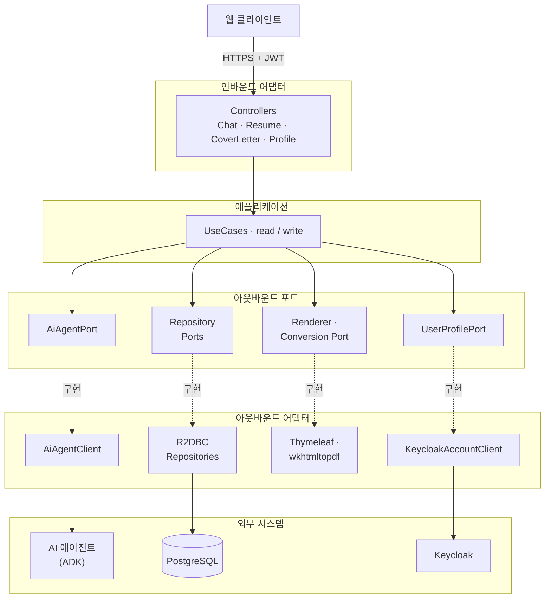
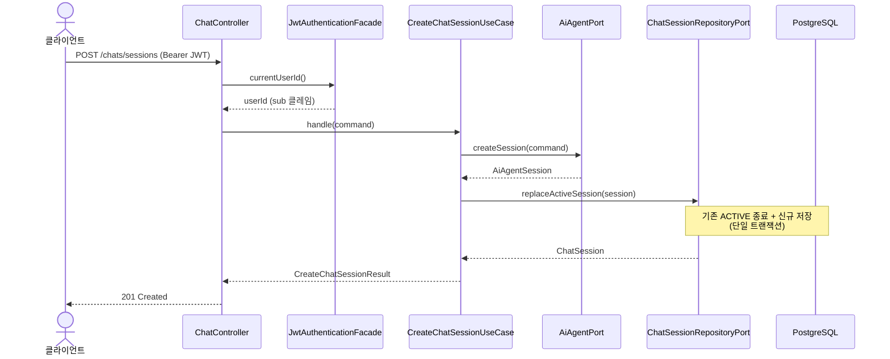
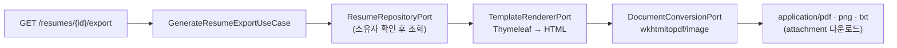

# Resume Core — AI 이력서·면접 중개 백엔드


Resume Core는 사용자와 외부 AI 에이전트 사이에서 중개자 역할을 하는 리액티브 백엔드입니다. 사용자의 채팅 요청을 AI 에이전트로 넘기고 그 응답을 실시간으로 되돌려줍니다. 이 과정에서 오간 이력서·자기소개서 데이터를 저장하고 PDF 같은 문서로 뽑아냅니다.

전 구간이 논블로킹(Spring WebFlux + R2DBC)으로 동작하며 인증은 Keycloak이 발급한 JWT로 처리합니다. 코드는 클린 아키텍처(헥사고날)를 따라 **유스케이스 → 포트 → 어댑터** 순서로 의존하도록 구성했습니다. 비즈니스 로직이 인터페이스(포트)에만 의존하므로 외부 시스템을 갈아끼워도 유스케이스는 건드릴 필요가 없습니다.

## 주요 기능
- **채팅 세션 중개**: AI 에이전트(ADK) 세션을 생성하고 응답을 SSE로 실시간 중계합니다(HITL 인터럽트 응답 포함).
- **이력서 CRUD**: 사용자별로 이력서를 저장·수정·조회·삭제합니다(JSONB 저장, 사용자당 활성 이력서 1개).
- **자기소개서**: CRUD는 물론 에이전트를 호출해 자기소개서를 생성(SSE 스트리밍)할 수 있습니다.
- **문서 내보내기**: 이력서를 PDF·PNG·TXT로 변환합니다(Thymeleaf 템플릿 + wkhtmltopdf).
- **프로필**: Keycloak Account API를 프록시해 프로필을 조회·수정합니다.

## 기술 스택

| 구분 | 사용 기술 |
| --- | --- |
| 언어 · 런타임 | Kotlin 2.3, JDK 25 |
| 프레임워크 | Spring Boot 4.0 (WebFlux, Security) |
| 비동기 · 스트림 | Project Reactor (`Mono` / `Flux`), Kotlin Coroutines |
| 영속화 | R2DBC (PostgreSQL), Flyway 마이그레이션 |
| 인증 | Keycloak JWT (OAuth2 Resource Server) |
| 문서 렌더링 | Thymeleaf 템플릿 → wkhtmltopdf / wkhtmltoimage |
| 외부 연동 | AI 에이전트(ADK) — `WebClient` 기반 HTTP · SSE |
| 테스트 | JUnit 5, MockK, Testcontainers(PostgreSQL), MockWebServer, WebTestClient |
| 빌드 | Gradle (Kotlin DSL) |

## 아키텍처

포트와 어댑터가 만드는 경계는 다음과 같습니다. 화살표 방향이 곧 의존성 방향입니다. 포트(인터페이스)와 그 구현인 어댑터 사이는 점선으로 표시했습니다.



### 디렉터리 구조

```
src/main/kotlin/com/resume/core
├─ application/         # 유스케이스 및 DTO (비즈니스 로직)
│  ├─ usecase/read/    # 조회 유스케이스 (Get, Stream, Generate, Export)
│  └─ usecase/write/   # 명령 유스케이스 (Create, Update, Delete, Save)
├─ port/               # 인바운드/아웃바운드 포트 인터페이스 (계약)
├─ adapter/            # 포트 구현
│  ├─ inbound/web/     # 컨트롤러, 요청/응답 모델
│  └─ outbound/        # 외부 클라이언트, R2DBC 영속화, 렌더링
├─ config/             # 횡단 관심사 (보안, R2DBC, PDF 설정)
└─ domain/model/       # 도메인 모델 (Resume, ChatSession, CoverLetter, UserProfile 등)
```

### 설계 원칙
- **의존성 역전**: 유스케이스는 포트(인터페이스)에 의존하고, 어댑터가 포트를 구현합니다.
- **리액티브 스트림**: 모든 연산은 `Mono<T>` / `Flux<T>` 를 반환하며 절대 블로킹하지 않습니다.
- **포트 명명**: 구현이 아닌 역량을 표현합니다 (예: `AiAgentPort`, `ChatSessionRepositoryPort`).
- **세션 생명주기**: 새 세션을 만들면 해당 사용자의 기존 ACTIVE 세션을 닫습니다.

## 요청 흐름

### 채팅 세션 생성과 스트리밍

세션을 만들 때는 AI 에이전트에 원격 세션을 먼저 만든 뒤 그 결과를 로컬 DB에 저장합니다. 이때 사용자 식별자(`userId`)는 요청 본문이 아니라 **JWT의 `sub` 클레임**에서만 가져옵니다. 클라이언트가 다른 사용자를 사칭할 수 없게 하기 위해서입니다.



이후 `POST /chats/run-sse`로 메시지를 보내면 소유권을 확인(`findByIdAndUserId`)한 세션에 한해서만 에이전트 응답을 SSE로 그대로 중계합니다.

### 문서 내보내기 파이프라인

이력서 내보내기는 조회 → 템플릿 렌더링 → 바이너리 변환의 3단계로 흐릅니다. 파일 IO와 외부 프로세스 실행처럼 블로킹이 불가피한 작업은 전용 스케줄러(`boundedElastic`)로 넘겨 이벤트 루프를 막지 않습니다.



## 로컬 개발

### 준비물
- **JDK 25** (Gradle toolchain으로 지정)
- **Docker & Docker Compose**
- **PostgreSQL** (외부 인스턴스 또는 `local-net` 도커 네트워크)
- **wkhtmltopdf** (PDF/PNG 생성용 — [`docs/wkhtmltopdf.md`](docs/wkhtmltopdf.md) 참고)

### 실행
```bash
# 도커 네트워크 생성 (없으면)
docker network create local-net 2>/dev/null || true

# (선택) 문서 변환용 wkhtmltopdf 컨테이너 기동
docker compose -f docker/docker-compose.yml up -d wkhtmltopdf

# 애플리케이션 실행 (기본 포트 8081)
./gradlew bootRun

# wkhtmltopdf 경로를 직접 지정하려면
WKHTMLTOPDF_PATH=./scripts/wkhtmltopdf.sh ./gradlew bootRun
```

## 빌드 & 테스트
| 명령어 | 설명 |
| --- | --- |
| `./gradlew build` | 컴파일 + 테스트 + JAR 생성 |
| `./gradlew test` | 전체 테스트 |
| `./gradlew test --tests "com.resume.core.adapter.inbound.web.ChatControllerTests"` | 단일 테스트 클래스 |
| `./gradlew bootJar` | 배포용 JAR |
| `./gradlew clean` | 빌드 산출물 정리 |

### 테스트 전략

계층마다 테스트 방식을 달리 가져갑니다. 바깥 계층은 실제에 가깝게, 안쪽 계층은 가볍고 빠르게 검증합니다.

| 대상 | 방식 | 도구 |
| --- | --- | --- |
| 컨트롤러 (adapter/inbound) | 슬라이스 테스트로 요청·응답·상태 코드를 검증합니다. 유스케이스와 인증은 목으로 대체합니다 | `@WebFluxTest`, WebTestClient, MockitoBean |
| 유스케이스 (application) | 스프링 컨텍스트 없이 순수 단위로 검증합니다. 포트를 목으로 주입합니다 | MockK, StepVerifier |
| 영속화 어댑터 (adapter/outbound/persistence) | 실제 PostgreSQL 컨테이너를 띄워 쿼리와 사용자 소유권 격리를 검증합니다 | Testcontainers |
| 외부 HTTP 클라이언트 | 목 서버로 AI 에이전트·Keycloak 응답을 흉내 냅니다 | MockWebServer |

- **리액티브 검증**: `Mono`/`Flux` 결과는 `reactor-test`의 `StepVerifier`로 방출 값과 에러를 단언합니다. 프로덕션 코드에서는 `.block()`을 쓰지 않고 테스트 단언에서만 허용합니다.
- **인증 목**: 컨트롤러 테스트는 `MockJwtWebFilter` / `MockJwtFactory`로 JWT를 주입해 인증된 사용자 흐름을 재현합니다.
- **파일 명명**: 동작 테스트는 `*Tests.kt`, 클라이언트·통합 테스트는 `*Test.kt`를 씁니다.

## 문서 내보내기 (PDF / PNG / TXT)

- 템플릿은 Thymeleaf 기반으로 `src/main/resources/templates/` 에서 관리합니다.
  ```
  templates/
  ├─ resume/       # default, modern, minimalist 등
  └─ partials/     # header, footer, profile, experience
  ```
- API:
  - `GET /api/resume-core/resumes/{resumeId}/export?format=pdf&template=modern`
  - `GET /api/resume-core/resumes/{resumeId}/pdf?template=modern` (하위 호환; `export?format=pdf` 와 동일)
  - 없는 템플릿 값은 자동으로 `default` 로 대체됩니다.
  - 응답은 `Content-Disposition: attachment` 헤더를 포함합니다.
- 렌더링 파이프라인: `ResumeTemplateRendererPort`(Thymeleaf) → `DocumentConversionPort`(wkhtmltopdf/wkhtmltoimage).
- wkhtmltopdf 경로·타임아웃은 `resume.pdf.*` 설정 또는 환경 변수(`WKHTMLTOPDF_PATH`, `WKHTML_TIMEOUT_SECONDS` 등)로 조정합니다.
- 설치/문제 해결은 [`docs/wkhtmltopdf.md`](docs/wkhtmltopdf.md)를 참고하세요.

## Docker 이미지 빌드
`Dockerfile` 은 미리 빌드한 JAR(`build/libs/*.jar`)을 복사하는 단일 런타임 스테이지이며, 컨테이너에 wkhtmltopdf 와 기본 폰트가 포함됩니다.
```bash
./gradlew bootJar
docker build -t resume-core .
docker run --rm -p 8081:8081 -e SPRING_PROFILES_ACTIVE=prod resume-core
```
기본 포트는 8081(`SERVER_PORT` 로 변경), JVM 옵션은 `JAVA_OPTS` 로 전달합니다.

## 데이터 계층 — R2DBC & Flyway

### 왜 JPA가 아니라 R2DBC인가

요청 처리 전 구간이 논블로킹이라 영속화도 여기에 맞췄습니다. JPA/Hibernate는 블로킹 드라이버인 JDBC 위에서 돌아갑니다. WebFlux 이벤트 루프에서 이를 쓰면 스레드를 붙잡거나 매번 별도 스레드풀로 넘겨야 합니다. 그러면 리액티브로 얻는 이점이 무너집니다. 그래서 논블로킹 드라이버인 **R2DBC(PostgreSQL)** 를 택했습니다. 컨트롤러부터 DB까지 `Mono`/`Flux` 하나로 이어집니다.

대신 R2DBC에는 JPA의 영속성 컨텍스트·더티 체킹·지연 로딩·연관관계 매핑이 없습니다. 이 프로젝트에는 오히려 잘 맞습니다. 저장 단위가 이력서·자기소개서·세션처럼 서로 독립적인 애그리거트이고 복잡한 조인 없이 문서를 JSONB 컬럼 하나에 통째로 담기 때문입니다.

### 영속화 방식

- **수동 매핑**: 엔티티(`ResumeEntity` 등)와 도메인 모델(`Resume` 등)을 `from()` / `toDomain()`으로 직접 변환합니다. R2DBC·JSONB 타입이 어댑터 밖으로 새지 않습니다.
- **JSONB 저장**: 이력서 데이터와 세션 상태는 `io.r2dbc.postgresql.codec.Json` 타입으로 매핑해 컬럼 하나에 문서로 보관합니다.
- **INSERT/UPDATE 제어**: 클라이언트가 UUID를 미리 정해 넘기기 때문에 "ID가 있으면 UPDATE"라는 기본 규칙을 그대로 쓸 수 없습니다. 엔티티가 `Persistable<UUID>`를 구현하고 `markNew()`로 신규 저장을 명시해 INSERT를 강제합니다.
- **리액티브 트랜잭션**: "기존 활성 레코드 비활성화 → 새 레코드 저장"처럼 함께 성공해야 하는 작업은 `TransactionalOperator`로 묶습니다. 중간에 실패해도 활성 레코드가 0개로 남지 않습니다.

### 스키마 관리 (Flyway)

스키마는 **Flyway** 마이그레이션으로만 바꿉니다. 애플리케이션 런타임은 R2DBC를 쓰지만 Flyway는 마이그레이션 실행을 위해 JDBC URL을 따로 사용합니다(`spring.flyway.url`은 `jdbc:...`, 런타임은 `r2dbc:...`).

- 위치: `src/main/resources/db/migration/postgres/`
- 명명 규칙: `V{major}_{minor}_{patch}__{설명}.sql`
- 이력 테이블: `resume_app_schema_history`
- **이미 적용된 마이그레이션은 절대 수정하지 않습니다.** 스키마를 바꿀 때는 항상 새 버전 파일을 추가합니다.

| 버전 | 내용 |
| --- | --- |
| `V1_0_0` ~ `V1_1_1` | 초기 사용자 테이블 (현재 사용자 관리는 Keycloak이 담당 — 레거시) |
| `V2_0_0`, `V2_0_1` | 채팅 세션 테이블 및 컬럼 정리 |
| `V3_0_0` | 이력서 테이블 (JSONB) |
| `V4_0_0` | 자기소개서 테이블 |

## 보안 & 환경 설정
- `SecurityConfig` 는 Keycloak JWT 리소스 서버를 구성합니다. `/api/resume-core/**` 는 유효한 Bearer 토큰이 필요합니다.
- 사용자 식별자는 요청 본문이 아니라 **JWT 의 `sub` 클레임**에서만 파생합니다.
- 실제 비밀 값은 환경 변수 또는 `application-local.yml`(Git 제외)로 관리하세요.
- 기본 개발 자격증명(`app_user`/`app_pass`)은 로컬 전용입니다.

## 코딩 컨벤션
- Kotlin 공식 스타일(4 스페이스, 멀티라인 trailing comma, 120자 가이드라인)
- 패키지 소문자 / 클래스·enum UpperCamelCase / 함수·프로퍼티 lowerCamelCase / 상수 SCREAMING_SNAKE_CASE
- 파일 하나에 공개 클래스 하나, 파일명은 클래스명과 일치
- 커밋: Conventional Commits (`feat:`, `fix:`, `refactor:` 등), 한국어 한 줄 요약
